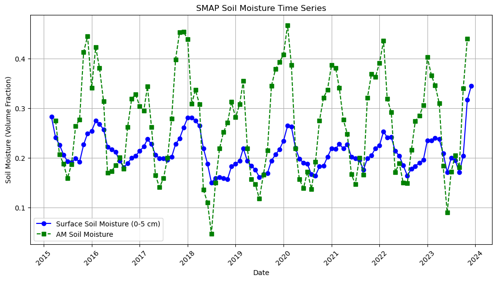

# SMAP Soil Moisture Data Extraction & Visualization

This Jupyter Notebook provides tools for:
- **Selecting a location interactively using an interactive map**
- **Extracting SMAP soil moisture data for the selected location**
- **Visualizing the corresponding SMAP pixel boundaries**
- **Exporting monthly mean soil moisture data as CSV**
- **Extracting soil moisture surface data from the SMAP SPL3SMP_E dataset**
- **Visualizing the extracted data as a time series plot**

---



📌 Prerequisites

- Operating System: Windows, macOS, or Linux

- Python 3.8+ (Ensure Python is installed before proceeding)

- [Google Earth Engine Python API](https://developers.google.com/earth-engine/guides/python_install)

- [Anaconda](https://docs.anaconda.com/miniconda/install/)

- [Git](https://git-scm.com/downloads)  (for cloning the repository)

## 📌 Setup Instructions

### 1️⃣ Install Conda (If Not Installed)

If you don’t have Conda installed, download and install it from [Miniconda Installation](https://docs.anaconda.com/miniconda/install/).

### 2️⃣ Open Anaconda Prompt

⚠️ IMPORTANT: Make sure to run all the following commands from Anaconda Prompt (not from Windows CMD or PowerShell). 

To open Anaconda Prompt:

Windows: Open Start Menu, search for Anaconda Prompt, and launch it.

Mac/Linux: Open a terminal window.


### 3️⃣ Clone the Repository**
```sh
git clone https://github.com/mkovac03/gee_smap.git
cd gee_smap
```

### 4️⃣ Create and Activate the Conda Environment**
```sh
conda env create -f environment.yml
conda activate smap_analysis
```

### 5️⃣ Authenticate Google Earth Engine**
Before running the notebook, authenticate Google Earth Engine (GEE) by running:
```sh
earthengine authenticate
```
Follow the prompts to complete the authentication.

### 6️⃣ Run Jupyter Lab**
```sh
jupyter lab
```
Open the Jupyter Notebook file (`smap_extraction.ipynb`) and run the cells in sequence.

---

## 📌 Features
✅ Interactive map selection for a **custom point location**  
✅ **Dynamically retrieves SMAP soil moisture data**  
✅ Extracts **monthly mean soil moisture** values and saves them to `smap_monthly_data.csv`  
✅ **Extracts soil moisture surface data from NASA's SMAP SPL3SMP_E dataset**  
✅ **Generates a time-series plot of extracted SMAP soil moisture data**  

---

## 📌 SMAP Products Overview

### **SPL3SMP_E.005 Level 3 Product**
- Provides a **daily composite** of global land surface conditions retrieved by the SMAP L-Band radiometer.
- **Temporal Resolution:** Daily  
- **Gridded Resolutions:** 9 km  
- **Availability:** March 31, 2015 - Present  
- **Uses:**  
  - L-band brightness temperature measures can be used to analyze **soil moisture, fine fuel moisture content, ocean salinity, and sea ice thickness**.
  - The **L3 surface soil moisture product is highly accurate**, within 4%.
  - The attenuation of soil-emitted radiation by vegetation **limits accuracy in densely forested areas**; therefore, masking the data with retrieval quality flag bands is recommended.
  - **Data Outages:** June 19 - July 23, 2019; September 20 - October 6, 2022.

### **SPL4SMGP.007 Level 4 Product**
- Includes **surface soil moisture (0-5 cm), root-zone soil moisture (0-100 cm),** and additional research products such as soil temperature and evapotranspiration.
- **Temporal Resolution:** 3-hourly  
- **Gridded Resolutions:** 11 km  
- **Availability:** March 31, 2015 - Present  
- **Uses:**  
  - Modeled outputs of **surface and root-zone soil moisture** with full global coverage and high temporal frequency.
  - **Provides uninterrupted soil moisture data**. During SMAP instrument outages, SMAP L4 soil moisture is based on land model simulations alone.
  - **Significant SMAP instrument outages occurred** between June 19 - July 23, 2019, and August 6 - September 20, 2022.

---

## 📌 SMAP Data Bands

| Name                | Units            | Min  | Max  | Description |
|---------------------|-----------------|------|------|-------------|
| soil_moisture_am   | Volume fraction | -    | -    | Retrieved soil moisture estimate from the disaggregated/downscaled vertical polarization brightness temperature at 9-km grid cell; AM overpass |
| sm_surface         | Volume fraction | 0    | 0.9  | Top layer soil moisture (0-5 cm) |

For more details and additional data bands, refer to:
- [NASA SMAP SPL3SMP_E.005 Dataset](https://developers.google.com/earth-engine/datasets/catalog/NASA_SMAP_SPL3SMP_E_005#bands)
- [NASA SMAP SPL4SMGP.007 Dataset](https://developers.google.com/earth-engine/datasets/catalog/NASA_SMAP_SPL4SMGP_007#bands)

---

## 📌 Expected Outputs

### **Console Output**
```
Selected Location: Longitude = -122.976837, Latitude = 49.117373
Using dynamically extracted SMAP scale: 9256.0 meters
SMAP data extraction completed. File saved as smap_monthly_data.csv
```

### **Generated CSV (`smap_monthly_data.csv`)**
```
sm_surface,Year,Month,Longitude,Latitude,soil_moisture_am
0.413,2014,1,-122.976837,49.117373,0.38
0.390,2014,2,-122.976837,49.117373,0.41
0.425,2014,3,-122.976837,49.117373,0.37
```

### **Map Output**
- The **SMAP soil moisture image** is displayed using a **color gradient**.
- The **selected SMAP pixel is vectorized and outlined in black**.

### **Time-Series Visualization Output**
- A **line plot** displaying SMAP soil moisture values over time.
- Different colors distinguish between **surface soil moisture (0-5 cm) and AM soil moisture**.
- Helps in analyzing **trends and seasonal variations in soil moisture**.

---

## 📌 Contributing
Feel free to submit pull requests if you find improvements! 🎉

---

## 📌 License
This project is licensed under the MIT License.

---
